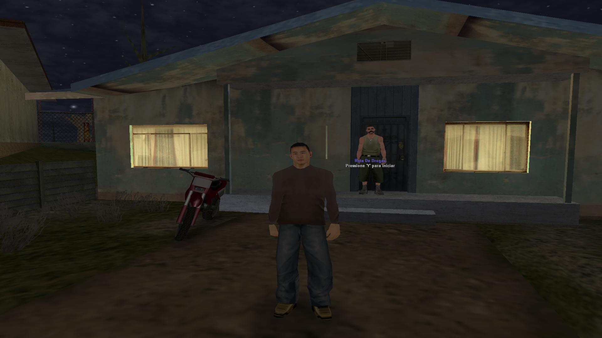
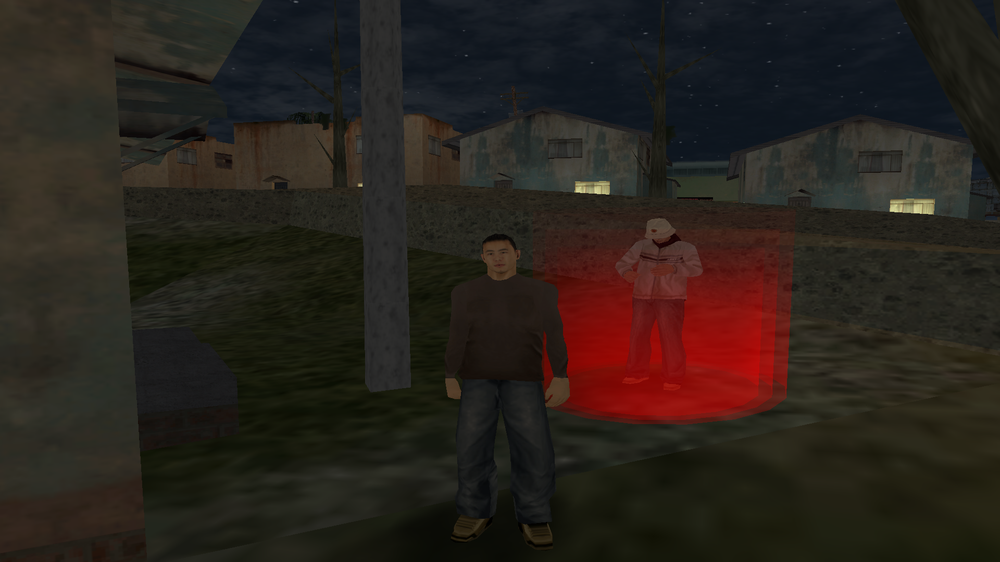

# 🫧 Sistema de Rotas de Drogas – SA-MP

**-** Um sistema completo para **rotas de drogas** em servidores SA-MP, permitindo que os jogadores realizem entregas, recebam recompensas e gerenciem suas rotas de forma dinâmica.

---

## ⚙️ Funcionalidades

| Funcionalidade    | Descrição                                                                      |
| ----------------- | ------------------------------------------------------------------------------ |
| Início da rota    | Jogadores podem iniciar rotas pressionando a tecla **'Y'** no local designado. |
| Entregas          | Entregas são geradas em **locais aleatórios** pela cidade.                     |
| Recompensas       | Ao completar entregas, o jogador recebe **dinheiro sujo** e **materiais**.     |
| Progresso da rota | Sistema de acompanhamento de entregas e conclusão de rotas.                    |

---

## 💬 Comando

| Comando   | Descrição                                                           |
| --------- | ------------------------------------------------------------------- |
| `/irrota` | Teleporta o jogador para o **local de início das rotas de drogas**. |

## 👀 Imagens

